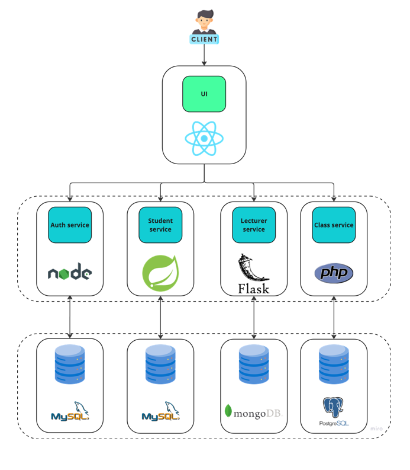
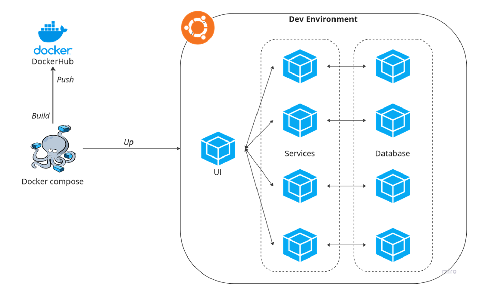

# Build a CI/CD Pipeline for Microservices Application

## 🛈 Overview

This project contains a sample **microservices application**. I designed and developed a full-stack web app using a microservices architecture included both front-end and back-end services.

## 💻 Microservices Architecture

The application is built using a microservices architecture comprising:
- [**Front-end Service**](https://github.com/th1enlm02/class-management-FE): The user interface of the application. (JavaScript, ReactJS)
- **Back-end Services**: Multiple services handling different business logic and data processing tasks:
    + [Auth Service](https://github.com/th1enlm02/class-management-auth-service): Handles user authentication, including login, registration, and session management. _(JavaScript, NodeJS, ExpressJS)_ → MySQL
    + [Student Service](https://github.com/th1enlm02/class-management-student-service): Manages student information, including storage, retrieval, update, and delete of student data. _(Java, Spring Boot framework)_ → MySQL
    + [Lecturer Service](https://github.com/th1enlm02/class-management-lecturer-service): Manages lecturer information, including storage, retrieval, update, and delete of lecturer data. _(Python, Flask)_ → MongoDB
    + [Class Service](https://github.com/th1enlm02/class-management-class-service): Manages class information, including storage, retrieval, update, and delete of class data. _(PHP)_ → PostgreSQL
<br>
<p align="center">
    
</p>

## 🤖 Dev Environment

Once a deployment phase is complete, the application is packaged and deployed to a local development environment. This setup allow us to verify that services, running as containers, perform as expected and conduct to necessary tests before moving to others environments.<br>
For microservices, where each service may use different technologies and languages, creating well-designed Dockerfiles is crucial. They must include all necessary configurations for effective packaging and deployment, and be clearly defined for easy testing and updates.<br>
[**Docker Compose**](https://docs.docker.com/compose/ "Docker Compose") plays a vital role in managing Docker-based applications. It simplifies the process of running multiple containers together and setting up a specific environment using a single YAML file. This file defines containers, ports, services, networks, volumes, and more, making packaging, distribution, and deployment straightforward, often with a single command.<br>

<p align="center">
    
</p>

## 🛠 Setup and Configuration

### Requirements

- **A Virtual Machine - Ubuntu** (prefer): This VM will host the necessary components for containerized application deployment and testing. Install required software:
    - [**Docker**](https://docs.docker.com/engine/install/ubuntu/)
    - [**Docker Compose**](https://docs.docker.com/compose/install/linux/)
- **A DockerHub account**: Create an account on DockerHub if you don't already have one. DockerHub will be used to store and manage Docker images for the application.<br>
→ You can sign up for a DockerHub account here: [DockerHub Sign Up](https://hub.docker.com/signup)

### Manual Deployment

This project is set up for auto deployment with Jenkins server by defining a Jenkins file _(Jenkinsfile.dev)_. You can also configure and deploy manually by following these steps below:

> **Notice**: This repo contains a **_.env_** file which defines sensitive information (such as databases's name, username, password and more). You should be re-defined to suitable with your context.

Clone this project to the VM manually:
```
git clone --recurse-submodules https://github.com/NT114-O21-DACN-DevOps/class-management.git
```
→ The command above will clone this repo along with all its submodules which contain all of the source codes for both front-end and back-end services.

After cloning the repositories, use `docker compose` command to build and run the application locally:
```
docker compose up --build -d
```

→ The `-d` option will help to run the command in detached mode (background), allowing you to continue working in the terminal without being occupied by Docker Compose logs.

### Testing the application

If you do not modify the docker compose file, you can access to the application front-end by the exposed port. _(3000)_<br>
Enter the URL below in the browser:

```
http://localhost:3000/
```
